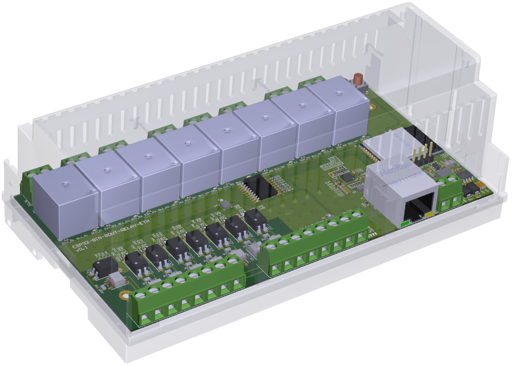

# ESPHome ESP32 IO boards

## 8 inputs, 8 outputs, relay, ethernet

### Features

- ESP32 based module
- 8 channel isolated inputs, supporting up to 230V mains voltage
- 8 channel relay outputs, 230V, 10A, common + normally open outputs
- 7-28V input power supply
- Ethernet (LAN8720) or WiFi connectivity
- Status leds for user use case
- DIN rail mountable with [Hammond enclosure 1597DIN9GY - 9 module](https://www.hammfg.com/part/1597DIN9GY?referer=1552) or similar
- ESPHome for a direct connection to home assistant

## Placeholder for future boards and their respective configuration

...
